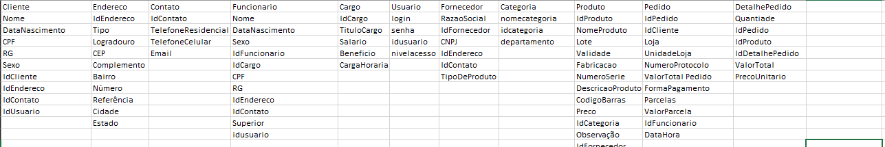
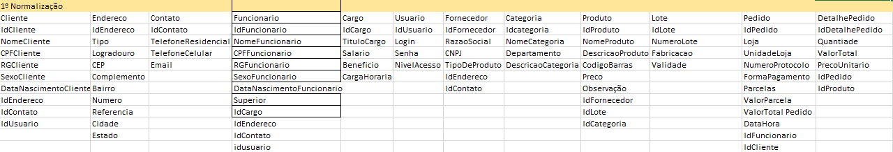
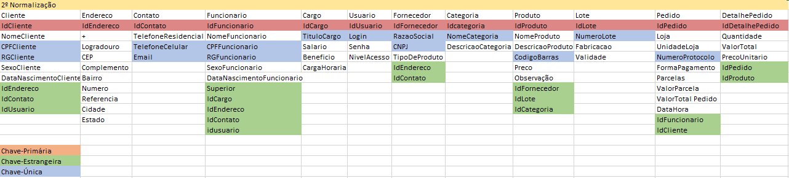
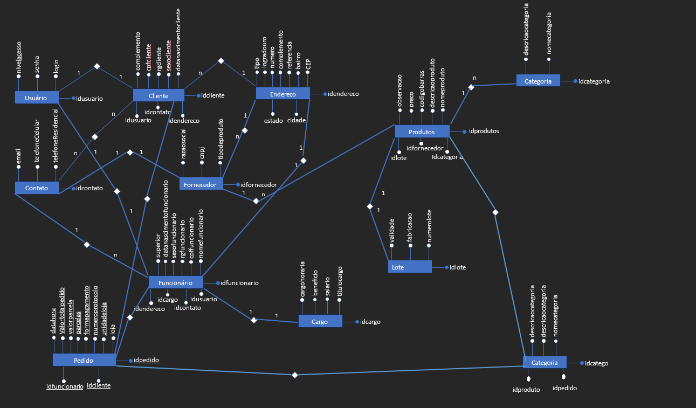
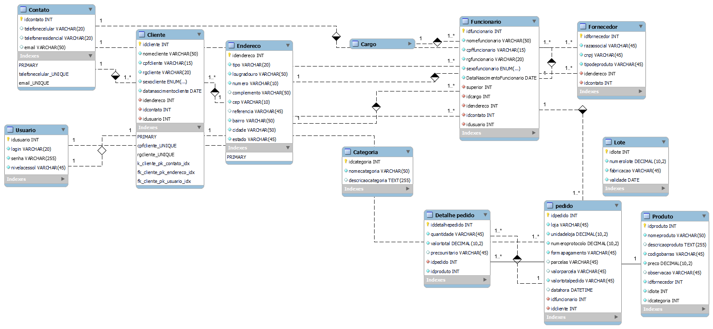

# Modelagem de dados 
## Banco de dados PaperBook
Segue as tabelas
Cliente; Endereço; Contato; Categoria; Fornecedor; Produto; Pedido; Detalhes do Pedido;


<HR>

No projeto de banco de dados, normalmente são considerados dois níveis de abstração de modelo de dados, o do modelo conceitual e o do modelo lógico.
Além dos dois citados acima, também temos o modelo físico com a usa implementação.

### Níveis de modelagem - Modelo de dados conceitual

Este é o modelo de “quadro geral” que representa a estrutura geral e o conteúdo, mas não os detalhes do plano de dados. É o ponto de partida típico para modelagem de dados, identificando os vários conjuntos de dados e fluxo de dados através da organização. O modelo conceitual é o projeto de alto nível para o desenvolvimento dos modelos lógico e físico e é uma parte importante da documentação da arquitetura de dados.

#### Modelagem conceitual no excel


#### Modelagem conceitual no excel - 1º Normalização


#### Modelagem conceitual no excel - 2º Normalização


#### Modelagem de dados com o diagrama de entidade relacional
#### Neste diagrama temos as cardenalidades
    -Um para muitos
    -Um para um


### Modelagem lógica
### Níveis de modelagem - Modelo de dados lógico
Um modelo lógico é uma descrição de um banco de dados no nível de abstração visto pelo usuário do SGBD. Assim, o modelo lógico é dependente do tipo particular de SGBD que está sendo usado. Vamos tratar apenas modelos lógicos referentes a SGBD relacional. Em um SGBD relacional, os dados estão organizados na forma de tabelas.



### Modelo Fisico do banco de dados 
### Abaixo está todo o código para a geração do banco de dados

```sql
-- MySQL Script generated by MySQL Workbench
-- Tue Jun 27 14:01:34 2023
-- Model: New Model    Version: 1.0
-- MySQL Workbench Forward Engineering

SET @OLD_UNIQUE_CHECKS=@@UNIQUE_CHECKS, UNIQUE_CHECKS=0;
SET @OLD_FOREIGN_KEY_CHECKS=@@FOREIGN_KEY_CHECKS, FOREIGN_KEY_CHECKS=0;
SET @OLD_SQL_MODE=@@SQL_MODE, SQL_MODE='ONLY_FULL_GROUP_BY,STRICT_TRANS_TABLES,NO_ZERO_IN_DATE,NO_ZERO_DATE,ERROR_FOR_DIVISION_BY_ZERO,NO_ENGINE_SUBSTITUTION';

-- -----------------------------------------------------
-- Schema paperbook
-- -----------------------------------------------------

-- -----------------------------------------------------
-- Schema paperbook
-- -----------------------------------------------------
CREATE SCHEMA IF NOT EXISTS `paperbook` DEFAULT CHARACTER SET utf8 ;
USE `paperbook` ;

-- -----------------------------------------------------
-- Table `paperbook`.`Usuario`
-- -----------------------------------------------------
CREATE TABLE IF NOT EXISTS `paperbook`.`Usuario` (
  `idusuario` INT NOT NULL AUTO_INCREMENT,
  `login` VARCHAR(20) NOT NULL,
  `senha` VARCHAR(255) NOT NULL,
  `nivelacessol` VARCHAR(45) CHARACTER SET 'utf8mb4' COLLATE 'utf8mb4_general_ci' NOT NULL,
  PRIMARY KEY (`idusuario`),
  UNIQUE INDEX `login_UNIQUE` (`login` ASC))
ENGINE = InnoDB;


-- -----------------------------------------------------
-- Table `paperbook`.`Contato`
-- -----------------------------------------------------
CREATE TABLE IF NOT EXISTS `paperbook`.`Contato` (
  `idcontato` INT NOT NULL AUTO_INCREMENT,
  `telefonecelular` VARCHAR(20) NULL,
  `telefoneresidencial` VARCHAR(20) NULL,
  `email` VARCHAR(50) NULL,
  PRIMARY KEY (`idcontato`),
  UNIQUE INDEX `telefonecelular_UNIQUE` (`telefonecelular` ASC),
  UNIQUE INDEX `email_UNIQUE` (`email` ASC))
ENGINE = InnoDB;


-- -----------------------------------------------------
-- Table `paperbook`.`Endereco`
-- -----------------------------------------------------
CREATE TABLE IF NOT EXISTS `paperbook`.`Endereco` (
  `idendereco` INT NOT NULL AUTO_INCREMENT,
  `tipo` VARCHAR(20) NOT NULL,
  `lougradouro` VARCHAR(50) NOT NULL,
  `numero` VARCHAR(10) NOT NULL,
  `complemento` VARCHAR(50) NULL,
  `cep` VARCHAR(10) NOT NULL,
  `referencia` VARCHAR(45) NULL,
  `bairro` VARCHAR(50) NOT NULL,
  `cidade` VARCHAR(50) NOT NULL,
  `estado` VARCHAR(45) NOT NULL,
  PRIMARY KEY (`idendereco`))
ENGINE = InnoDB;


-- -----------------------------------------------------
-- Table `paperbook`.`Cliente`
-- -----------------------------------------------------
CREATE TABLE IF NOT EXISTS `paperbook`.`Cliente` (
  `idcliente` INT NOT NULL AUTO_INCREMENT,
  `nomecliente` VARCHAR(50) NOT NULL,
  `cpfcliente` VARCHAR(15) NOT NULL,
  `rgcliente` VARCHAR(20) NOT NULL,
  `sexocliente` ENUM("Masculino", "Feminino") NOT NULL,
  `datanascimentocliente` DATE NOT NULL,
  `idendereco` INT NOT NULL,
  `idcontato` INT NOT NULL,
  `idusuario` INT NOT NULL,
  PRIMARY KEY (`idcliente`),
  UNIQUE INDEX `cpfcliente_UNIQUE` (`cpfcliente` ASC) ,
  UNIQUE INDEX `rgcliente_UNIQUE` (`rgcliente` ASC) ,
  INDEX `k_cliente_pk_contato_idx` (`idcontato` ASC) ,
  INDEX `fk_cliente_pk_endereco_idx` (`idendereco` ASC) ,
  INDEX `fk_cliente_pk_usuario_idx` (`idusuario` ASC) ,
  CONSTRAINT `fk_cliente_pk_contato`
    FOREIGN KEY (`idcontato`)
    REFERENCES `paperbook`.`Contato` (`idcontato`)
    ON DELETE NO ACTION
    ON UPDATE NO ACTION,
  CONSTRAINT `fk_cliente_pk_endereco`
    FOREIGN KEY (`idendereco`)
    REFERENCES `paperbook`.`Endereco` (`idendereco`)
    ON DELETE NO ACTION
    ON UPDATE NO ACTION,
  CONSTRAINT `fk_cliente_pk_usuario`
    FOREIGN KEY (`idusuario`)
    REFERENCES `paperbook`.`Usuario` (`idusuario`)
    ON DELETE NO ACTION
    ON UPDATE NO ACTION)
ENGINE = InnoDB;


-- -----------------------------------------------------
-- Table `paperbook`.`Cargo`
-- -----------------------------------------------------
CREATE TABLE IF NOT EXISTS `paperbook`.`Cargo` (
  `idcargo` INT NOT NULL AUTO_INCREMENT,
  `titulocargo` VARCHAR(50) NOT NULL,
  `salario` DECIMAL(7,2) NOT NULL,
  `beneficio` VARCHAR(45) NOT NULL,
  `cargahoraria` VARCHAR(45) NOT NULL,
  PRIMARY KEY (`idcargo`),
  UNIQUE INDEX `titulocargo_UNIQUE` (`titulocargo` ASC) )
ENGINE = InnoDB;


-- -----------------------------------------------------
-- Table `paperbook`.`Funcionario`
-- -----------------------------------------------------
CREATE TABLE IF NOT EXISTS `paperbook`.`Funcionario` (
  `idfuncionario` INT NOT NULL AUTO_INCREMENT,
  `nomefuncionario` VARCHAR(50) NOT NULL,
  `cpffuncionario` VARCHAR(15) NOT NULL,
  `rgfuncionario` VARCHAR(20) NOT NULL,
  `sexofuncionario` ENUM("Masculino", "Feminino") NOT NULL,
  `DataNascimentoFuncionario` DATE NOT NULL,
  `superior` INT NOT NULL,
  `idcargo` INT NOT NULL,
  `idendereco` INT NOT NULL,
  `idcontato` INT NOT NULL,
  `idusuario` INT NOT NULL,
  PRIMARY KEY (`idfuncionario`),
  UNIQUE INDEX `cpffuncionario_UNIQUE` (`cpffuncionario` ASC) ,
  UNIQUE INDEX `rgfuncionario_UNIQUE` (`rgfuncionario` ASC) ,
  INDEX `pf_funcionario_pk_superior_idx` (`superior` ASC) ,
  INDEX `pf_funcionario_pk_cargo_idx` (`idcargo` ASC) ,
  INDEX `pf_funcionario_pk_endereco_idx` (`idendereco` ASC) ,
  INDEX `pf_funcionario_pk_contato_idx` (`idcontato` ASC) ,
  INDEX `pf_funcionario_pk_idusuario_idx` (`idusuario` ASC) ,
  CONSTRAINT `pf_funcionario_pk_superior`
    FOREIGN KEY (`superior`)
    REFERENCES `paperbook`.`Funcionario` (`idfuncionario`)
    ON DELETE NO ACTION
    ON UPDATE NO ACTION,
  CONSTRAINT `pf_funcionario_pk_cargo`
    FOREIGN KEY (`idcargo`)
    REFERENCES `paperbook`.`Cargo` (`idcargo`)
    ON DELETE NO ACTION
    ON UPDATE NO ACTION,
  CONSTRAINT `pf_funcionario_pk_endereco`
    FOREIGN KEY (`idendereco`)
    REFERENCES `paperbook`.`Endereco` (`idendereco`)
    ON DELETE NO ACTION
    ON UPDATE NO ACTION,
  CONSTRAINT `pf_funcionario_pk_contato`
    FOREIGN KEY (`idcontato`)
    REFERENCES `paperbook`.`Contato` (`idcontato`)
    ON DELETE NO ACTION
    ON UPDATE NO ACTION,
  CONSTRAINT `pf_funcionario_pk_idusuario`
    FOREIGN KEY (`idusuario`)
    REFERENCES `paperbook`.`Usuario` (`idusuario`)
    ON DELETE NO ACTION
    ON UPDATE NO ACTION)
ENGINE = InnoDB;


-- -----------------------------------------------------
-- Table `paperbook`.`Fornecedor`
-- -----------------------------------------------------
CREATE TABLE IF NOT EXISTS `paperbook`.`Fornecedor` (
  `idfornecedor` INT NOT NULL AUTO_INCREMENT,
  `razaosocial` VARCHAR(45) NOT NULL,
  `cnpj` VARCHAR(45) NOT NULL,
  `tipodeproduto` VARCHAR(45) NOT NULL,
  `idendereco` INT NOT NULL,
  `idcontato` INT NOT NULL,
  PRIMARY KEY (`idfornecedor`),
  UNIQUE INDEX `cnpj_UNIQUE` (`cnpj` ASC) ,
  UNIQUE INDEX `razaosocial_UNIQUE` (`razaosocial` ASC) ,
  INDEX `pf_fornecedor_pk_endereco_idx` (`idendereco` ASC) ,
  INDEX `pf_fornecedor_pk_contato_idx` (`idcontato` ASC) ,
  CONSTRAINT `pf_fornecedor_pk_endereco`
    FOREIGN KEY (`idendereco`)
    REFERENCES `paperbook`.`Endereco` (`idendereco`)
    ON DELETE NO ACTION
    ON UPDATE NO ACTION,
  CONSTRAINT `pf_fornecedor_pk_contato`
    FOREIGN KEY (`idcontato`)
    REFERENCES `paperbook`.`Contato` (`idcontato`)
    ON DELETE NO ACTION
    ON UPDATE NO ACTION)
ENGINE = InnoDB;


-- -----------------------------------------------------
-- Table `paperbook`.`Categoria`
-- -----------------------------------------------------
CREATE TABLE IF NOT EXISTS `paperbook`.`Categoria` (
  `idcategoria` INT NOT NULL AUTO_INCREMENT,
  `nomecategoria` VARCHAR(50) NOT NULL,
  `descricaocategoria` TEXT(255) NULL,
  PRIMARY KEY (`idcategoria`),
  UNIQUE INDEX `nomecategoria_UNIQUE` (`nomecategoria` ASC) )
ENGINE = InnoDB;


-- -----------------------------------------------------
-- Table `paperbook`.`Produto`
-- -----------------------------------------------------
CREATE TABLE IF NOT EXISTS `paperbook`.`Produto` (
  `idproduto` INT NOT NULL AUTO_INCREMENT,
  `nomeproduto` VARCHAR(50) NOT NULL,
  `descricaoproduto` TEXT(255) NULL,
  `codigobarras` VARCHAR(45) NOT NULL,
  `preco` DECIMAL(10,2) NOT NULL,
  `observacao` VARCHAR(45) NULL,
  `idfornecedor` INT NOT NULL,
  `idlote` INT NOT NULL,
  `idcategoria` INT NOT NULL,
  PRIMARY KEY (`idproduto`),
  UNIQUE INDEX `codigobarras_UNIQUE` (`codigobarras` ASC) )
ENGINE = InnoDB;


-- -----------------------------------------------------
-- Table `paperbook`.`Lote`
-- -----------------------------------------------------
CREATE TABLE IF NOT EXISTS `paperbook`.`Lote` (
  `idlote` INT NOT NULL AUTO_INCREMENT,
  `numerolote` DECIMAL(10,2) NOT NULL,
  `fabricacao` VARCHAR(45) NOT NULL,
  `validade` DATE NOT NULL,
  PRIMARY KEY (`idlote`),
  UNIQUE INDEX `numerolote_UNIQUE` (`numerolote` ASC) )
ENGINE = InnoDB;


-- -----------------------------------------------------
-- Table `paperbook`.`pedido`
-- -----------------------------------------------------
CREATE TABLE IF NOT EXISTS `paperbook`.`Pedido` (
  `idpedido` INT NOT NULL AUTO_INCREMENT,
  `loja` VARCHAR(45) NOT NULL,
  `unidadeloja` DECIMAL(10,2) NOT NULL,
  `numeroprotocolo` DECIMAL(10,2) NOT NULL,
  `formapagamento` VARCHAR(45) NOT NULL,
  `parcelas` VARCHAR(45) NULL,
  `valorparcela` VARCHAR(45) NULL,
  `valortotalpedido` VARCHAR(45) NOT NULL,
  `datahora` DATETIME NULL,
  `idfuncionario` INT NOT NULL,
  `idcliente` INT NOT NULL,
  PRIMARY KEY (`idpedido`),
  UNIQUE INDEX `numeroprotocolo_UNIQUE` (`numeroprotocolo` ASC) ,
  INDEX `pf_pedido_pk_funcionario_idx` (`idfuncionario` ASC) ,
  INDEX `pf_pedido_pk_cliente_idx` (`idcliente` ASC) ,
  CONSTRAINT `pf_pedido_pk_funcionario`
    FOREIGN KEY (`idfuncionario`)
    REFERENCES `paperbook`.`Funcionario` (`idfuncionario`)
    ON DELETE NO ACTION
    ON UPDATE NO ACTION,
  CONSTRAINT `pf_pedido_pk_cliente`
    FOREIGN KEY (`idcliente`)
    REFERENCES `paperbook`.`Cliente` (`idcliente`)
    ON DELETE NO ACTION
    ON UPDATE NO ACTION)
ENGINE = InnoDB;


-- -----------------------------------------------------
-- Table `paperbook`.`Detalhe pedido`
-- -----------------------------------------------------
CREATE TABLE IF NOT EXISTS `paperbook`.`Detalhe pedido` (
  `iddetalhepedido` INT NOT NULL AUTO_INCREMENT,
  `quantidade` VARCHAR(45) NOT NULL,
  `valortotal` DECIMAL(10,2) NOT NULL,
  `precounitario` VARCHAR(45) NULL,
  `idpedido` INT NOT NULL,
  `idproduto` INT NOT NULL,
  PRIMARY KEY (`iddetalhepedido`),
  INDEX `pf_detalhe_pk_pedido_idx` (`idpedido` ASC) ,
  CONSTRAINT `pf_detalhe_pk_pedido`
    FOREIGN KEY (`idpedido`)
    REFERENCES `paperbook`.`pedido` (`idpedido`)
    ON DELETE NO ACTION
    ON UPDATE NO ACTION,
  CONSTRAINT `pf_detalhe_pk_produto`
    FOREIGN KEY ()
    REFERENCES `paperbook`.`Produto` ()
    ON DELETE NO ACTION
    ON UPDATE NO ACTION)
ENGINE = InnoDB;


SET SQL_MODE=@OLD_SQL_MODE;
SET FOREIGN_KEY_CHECKS=@OLD_FOREIGN_KEY_CHECKS;
SET UNIQUE_CHECKS=@OLD_UNIQUE_CHECKS;
```

